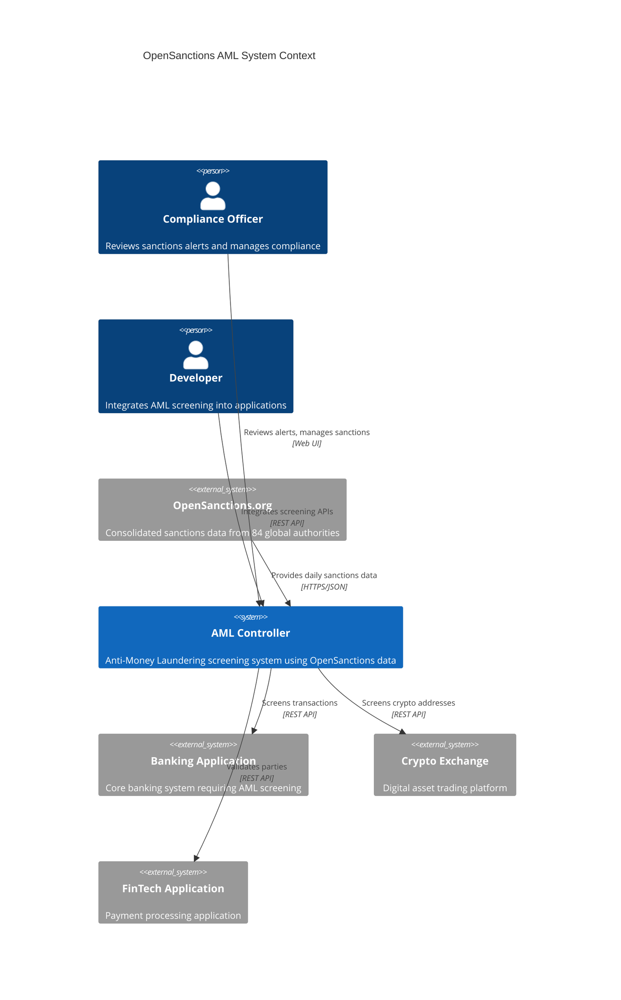
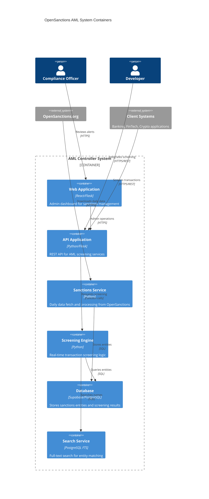
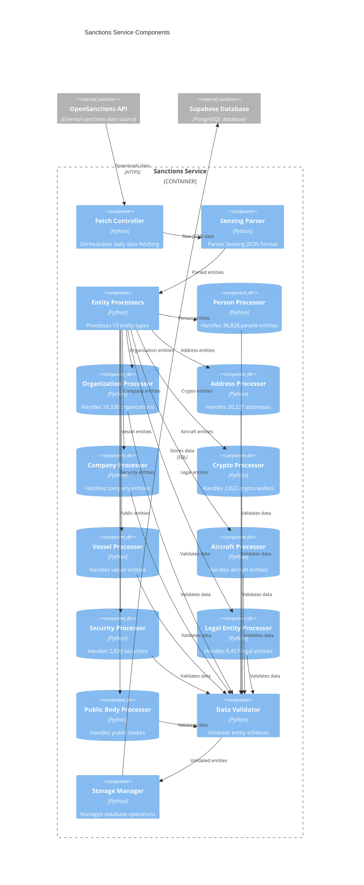
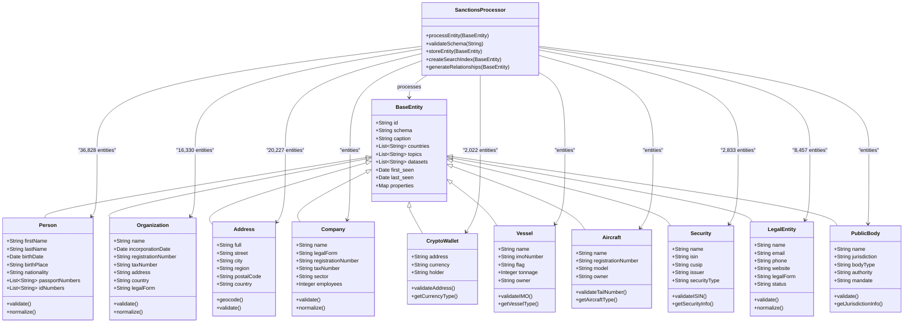
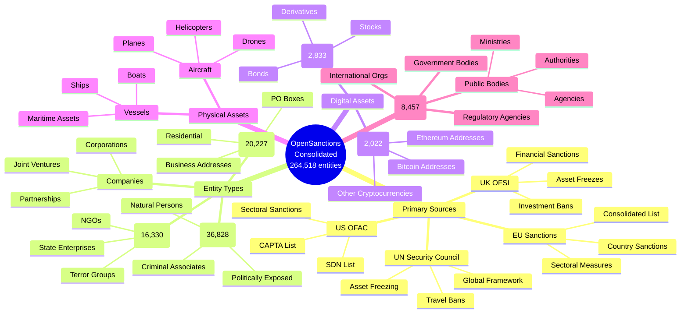

# OpenSanctions AML System - C4 Architecture Diagrams

## C4 Level 1: System Context Diagram

## C4 Level 2: Container Diagram

## C4 Level 3: Component Diagram - Sanctions Service

## C4 Level 4: Code Diagram - Entity Data Composition

## Data Source Composition

---

**C4 Diagram Version**: 1.0  
**Created**: 2025-08-22  
**Framework**: C4 Model with Mermaid  
**Focus**: Data Composition and System Architecture