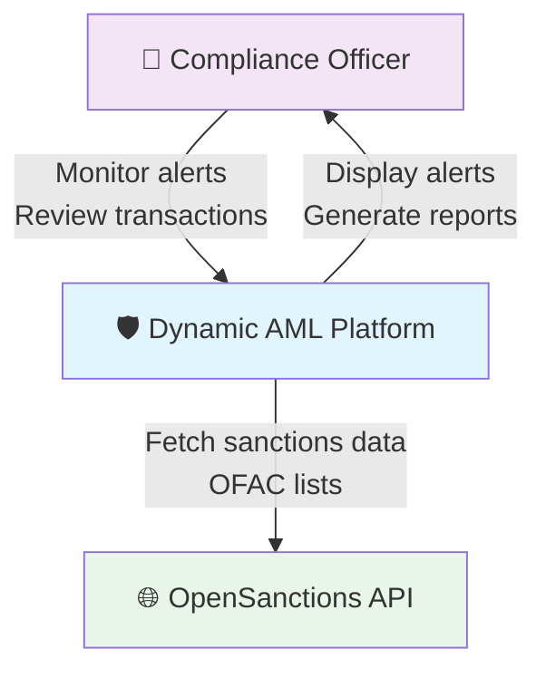
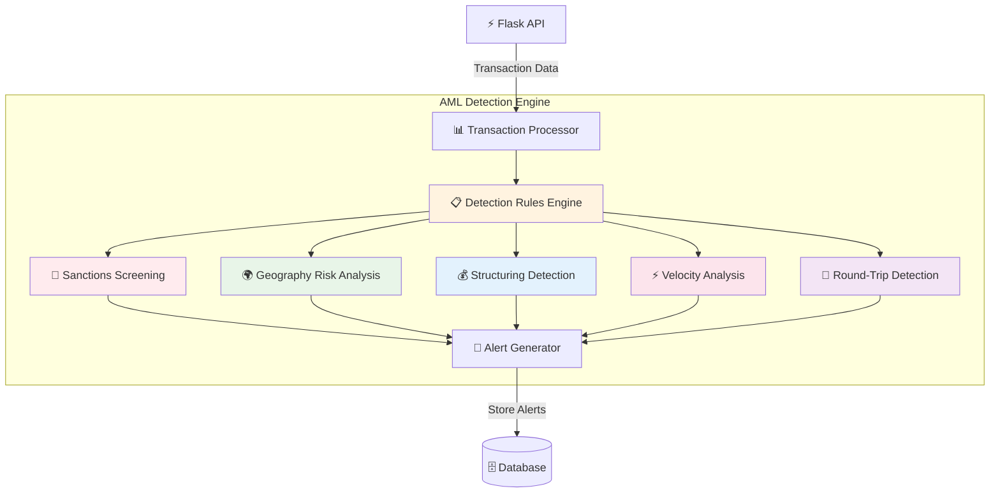
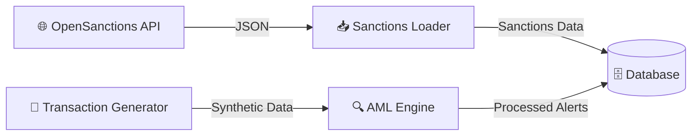

# 🛡️ Dynamic AML Detection Platform

**Real-Time Anti-Money Laundering System with Live Data Processing**

[](https://aml-controller.onrender.com/)
[](https://github.com/paihari/aml-controller)
[](LICENSE)

---

## 🌟 Overview

A **dynamic Anti-Money Laundering (AML) detection platform** that processes financial transactions in real-time through advanced rule-based algorithms. The system features live sanctions data integration, dynamic transaction generation, and a modern web dashboard for real-time monitoring of compliance alerts and risk assessments.

### ✨ Key Features
- 🔄 **Real-Time Processing** - Live transaction monitoring and alert generation
- 🌐 **Live Sanctions Data** - Integration with OpenSanctions API and OFAC lists
- 🎲 **Dynamic Transaction Generation** - Realistic transaction patterns for testing
- 📊 **Interactive Dashboard** - Real-time visualizations and alert management
- 🗄️ **Database Backend** - Persistent storage with SQLite/PostgreSQL support
- ⚡ **RESTful API** - Complete API for external integrations

---

## 🚀 Live Demo

**🌐 [View Dynamic AML System →](https://aml-controller.onrender.com/)**

Experience the full dynamic AML platform with:
- Real-time transaction processing
- Live sanctions screening
- Dynamic alert generation
- Interactive risk analytics
- Professional compliance dashboard

---

## 🏗️ Architecture Overview (C4 Model)

### Level 1: System Context Diagram



### Level 2: Container Diagram


### Level 3: Component Diagram - AML Engine



### Level 4: Code Structure

```
dynamic-aml-system/
├── 🌐 Web Layer
│   ├── app.py                      # Flask API Server
│   └── dashboard/
│       └── dynamic.html            # Real-time Dashboard
├── 🔍 Core Engine
│   ├── dynamic_aml_engine.py       # Main AML Detection Engine
│   ├── database.py                 # Database Operations
│   ├── sanctions_loader.py         # External Data Integration
│   └── transaction_generator.py    # Dynamic Data Generation
├── 🗄️ Data Layer
│   └── aml_database.db            # SQLite Database
└── 🚀 Deployment
    ├── requirements.txt            # Python Dependencies
    ├── Dockerfile                  # Container Configuration
    ├── render.yaml                 # Render Deployment Config
    └── fly.toml                    # Fly.io Deployment Config
```

---

## 🎯 Detection Capabilities

### 🔍 **Real-Time Detection Rules**

| Rule | Description | Risk Score | Trigger Conditions |
|------|-------------|------------|-------------------|
| **R1: Sanctions Screening** | OFAC/UN/EU watchlist matching | 95% | Name fuzzy match with sanctions lists |
| **R2: Geography Risk** | High-risk corridor analysis | 60-85% | Transactions from/to high-risk countries |
| **R3: Structuring Detection** | Multiple small transactions | 80% | 4+ transactions under $10K threshold |
| **R4: Velocity Anomalies** | Unusual transaction frequency | 70% | 10+ transactions in 24 hours |
| **R5: Round-Trip Detection** | Circular money flow patterns | 75% | Same parties with opposing flows |

### 📊 **Live Data Sources**

```python
# Real-time sanctions data integration
class SanctionsLoader:
    def load_opensanctions_data(self):
        """Fetch live sanctions from OpenSanctions API"""
        response = requests.get(f"{api_base}/search", params={
            "limit": 1000,
            "topics": "sanction,crime,poi",
            "format": "json"
        })
        
    def load_ofac_data(self):
        """Fetch OFAC Specially Designated Nationals list"""
        # Real OFAC integration
```

---

## 🚀 Quick Start

### 📦 **1. Clone & Setup**
```bash
git clone https://github.com/paihari/aml-controller.git
cd aml-controller
pip install -r requirements.txt
```

### 🔍 **2. Run Locally**
```bash
# Start the dynamic AML system
python app.py

# System will automatically:
# ✅ Initialize SQLite database
# ✅ Load live sanctions data
# ✅ Generate test transactions
# ✅ Start AML processing engine
# ✅ Launch web dashboard
```

### 🌐 **3. Access Dashboard**
```bash
# Dashboard available at:
http://localhost:5000/dashboard/dynamic.html

# API endpoints:
http://localhost:5000/api/health
http://localhost:5000/api/statistics
http://localhost:5000/api/alerts
```

---

## 🔄 Data Flow Architecture

### 📥 **Input Layer**


### ⚡ **Processing Layer**
```python
# Real-time transaction processing pipeline
def process_transaction(self, transaction_data):
    """Process single transaction through AML engine"""
    alerts = []
    
    # Store transaction
    tx_id = self.db.add_transaction(transaction_data)
    
    # Run all detection rules
    alerts.extend(self._check_sanctions_screening(transaction_data))
    alerts.extend(self._check_high_risk_geography(transaction_data))
    alerts.extend(self._check_structuring_patterns(transaction_data))
    alerts.extend(self._check_velocity_anomalies(transaction_data))
    alerts.extend(self._check_round_trip_transactions(transaction_data))
    
    # Store generated alerts
    for alert in alerts:
        self.db.add_alert(alert)
    
    return alerts
```

### 📊 **Output Layer**
- **Real-time Dashboard** - Live alert monitoring
- **RESTful API** - External system integration
- **Alert Management** - Case workflow system
- **Compliance Reports** - Regulatory submissions

---

## 🌐 API Documentation

### 📡 **Core Endpoints**

| Endpoint | Method | Description | Response |
|----------|--------|-------------|----------|
| `/api/health` | GET | System health check | Status and version |
| `/api/statistics` | GET | System statistics | Counts and metrics |
| `/api/alerts` | GET | Active alerts list | Alert details with evidence |
| `/api/transactions` | GET | Recent transactions | Transaction history |
| `/api/transactions` | POST | Process single transaction | Generated alerts |
| `/api/transactions/batch` | POST | Process transaction batch | Batch processing results |
| `/api/generate/process` | GET/POST | Generate test data | Sample transactions and alerts |
| `/api/sanctions/search` | GET | Search sanctions by name | Matching entries |
| `/api/sanctions/refresh` | POST | Refresh sanctions data | Updated counts |
| `/api/dashboard/data` | GET | Complete dashboard data | All data for frontend |

### 🔧 **Example API Usage**

```javascript
// Fetch system statistics
const stats = await fetch('/api/statistics').then(r => r.json());
console.log(`Active alerts: ${stats.data.active_alerts}`);

// Process a transaction
const transaction = {
    transaction_id: "TXN_001",
    amount: 50000,
    currency: "USD",
    sender_name: "John Smith",
    receiver_name: "Vladimir Petrov",
    sender_country: "US",
    receiver_country: "RU"
};

const result = await fetch('/api/transactions', {
    method: 'POST',
    headers: { 'Content-Type': 'application/json' },
    body: JSON.stringify(transaction)
}).then(r => r.json());

console.log(`Generated ${result.alerts_generated} alerts`);
```

---

## 🗄️ Database Schema

### 📋 **Core Tables**

```sql
-- Sanctions watchlist data
CREATE TABLE sanctions (
    id INTEGER PRIMARY KEY,
    name TEXT NOT NULL,
    name_normalized TEXT,
    country TEXT,
    sanctions_type TEXT,
    program TEXT,
    source TEXT,
    date_added TEXT
);

-- Transaction records
CREATE TABLE transactions (
    id INTEGER PRIMARY KEY,
    transaction_id TEXT UNIQUE,
    amount REAL,
    currency TEXT,
    sender_name TEXT,
    receiver_name TEXT,
    sender_country TEXT,
    receiver_country TEXT,
    transaction_date TEXT,
    created_at TEXT DEFAULT CURRENT_TIMESTAMP
);

-- AML alerts
CREATE TABLE alerts (
    id INTEGER PRIMARY KEY,
    alert_id TEXT UNIQUE,
    transaction_id TEXT,
    typology TEXT,
    risk_score REAL,
    alert_reason TEXT,
    evidence TEXT,
    status TEXT DEFAULT 'OPEN',
    created_at TEXT DEFAULT CURRENT_TIMESTAMP
);
```

---

## 📊 Performance Metrics

| Metric | Value | Description |
|--------|--------|-------------|
| **Transaction Processing** | <100ms | Per transaction through all rules |
| **Sanctions Screening** | <50ms | 1000+ watchlist entries |
| **Database Response** | <10ms | SQLite query performance |
| **API Response Time** | <200ms | Average endpoint response |
| **Dashboard Load Time** | <1s | Complete dashboard with data |
| **Memory Usage** | <128MB | Runtime memory footprint |

---

## 🚀 Deployment Options

### ☁️ **Cloud Platforms**

| Platform | URL | Free Tier | Deploy Time |
|----------|-----|-----------|-------------|
| **Render** | [aml-controller.onrender.com](https://aml-controller.onrender.com) | ✅ 512MB RAM | ~3 minutes |
| **Fly.io** | `fly deploy` | ✅ 256MB RAM | ~2 minutes |
| **Railway** | GitHub integration | ❌ Paid only | ~1 minute |
| **Azure** | Container Instances | ❌ Paid only | ~5 minutes |

### 🐳 **Docker Deployment**

```dockerfile
# Production-ready container
FROM python:3.11-slim
WORKDIR /app
COPY requirements.txt .
RUN pip install -r requirements.txt
COPY . .
EXPOSE 5000
CMD ["python", "app.py"]
```

```bash
# Build and run container
docker build -t dynamic-aml-system .
docker run -p 5000:5000 dynamic-aml-system
```

---

## 🛠️ Technology Stack

### **Backend Core**
-  **Python 3.11+** - Core processing engine
-  **Flask** - Web framework and REST API
-  **SQLite** - Embedded database
- **Requests** - HTTP client for external APIs
- **Faker** - Realistic test data generation

### **Frontend Dashboard**
-  **HTML5/CSS3** - Responsive interface
-  **JavaScript ES6+** - Interactive features
-  **Chart.js** - Real-time visualizations

### **External Integrations**
- **OpenSanctions API** - Live sanctions data
- **OFAC SDN List** - US Treasury sanctions
- **JSON REST APIs** - Data exchange format

---

## 🔐 Security & Compliance

### 🛡️ **Security Features**
- ✅ **HTTPS Enforcement** - Secure data transmission
- ✅ **Input Validation** - SQL injection prevention
- ✅ **Error Handling** - Graceful failure management
- ✅ **CORS Protection** - Cross-origin request security
- ✅ **Rate Limiting** - API abuse prevention

### 📋 **Regulatory Compliance**
- **BSA/AML** - US Bank Secrecy Act compliance
- **EU AMLD6** - European Anti-Money Laundering Directive
- **FATF Standards** - Financial Action Task Force guidelines
- **KYC Requirements** - Know Your Customer procedures
- **Sanctions Compliance** - OFAC, UN, EU sanctions screening

---

## 📈 Future Roadmap

### 🎯 **Planned Enhancements**
- [ ] **Machine Learning** - Advanced pattern detection with TensorFlow
- [ ] **Real-time Streaming** - Apache Kafka integration
- [ ] **Advanced Analytics** - Predictive risk modeling
- [ ] **Case Management** - Investigation workflow system
- [ ] **Multi-tenancy** - Enterprise customer isolation

### 🔧 **Technical Improvements**
- [ ] **PostgreSQL** - Production database upgrade
- [ ] **Redis Cache** - Performance optimization
- [ ] **Microservices** - Containerized architecture
- [ ] **GraphQL API** - Advanced query capabilities
- [ ] **Real-time WebSockets** - Live dashboard updates

---

## 🤝 Contributing

We welcome contributions! Please see our [Contributing Guide](CONTRIBUTING.md) for details.

### 🎯 **Development Setup**
```bash
# Clone repository
git clone https://github.com/paihari/aml-controller.git
cd aml-controller

# Create virtual environment
python -m venv venv
source venv/bin/activate  # Linux/Mac
# or
venv\Scripts\activate     # Windows

# Install dependencies
pip install -r requirements.txt

# Run tests
python -m pytest tests/

# Start development server
python app.py
```

---

## 📄 License

This project is licensed under the **MIT License** - see the [LICENSE](LICENSE) file for details.

---

## 📞 Support & Contact

### 🆘 **Getting Help**
- 🐛 **Issues**: [GitHub Issues](https://github.com/paihari/aml-controller/issues)
- 💬 **Discussions**: [GitHub Discussions](https://github.com/paihari/aml-controller/discussions)
- 📖 **Documentation**: [Wiki](https://github.com/paihari/aml-controller/wiki)

### 🌟 **Connect With Us**
[](https://github.com/paihari/aml-controller/stargazers)
[](https://github.com/paihari/aml-controller/network/members)

---

<div align="center">

**🛡️ Dynamic AML Detection • 🌐 Real-Time Processing • ⚡ Production Ready**

[🚀 **Try Live Demo**](https://aml-controller.onrender.com/) • [📊 **View Code**](https://github.com/paihari/aml-controller) • [📖 **Read Docs**](https://github.com/paihari/aml-controller/wiki)

*Built for modern financial compliance teams worldwide*

</div>