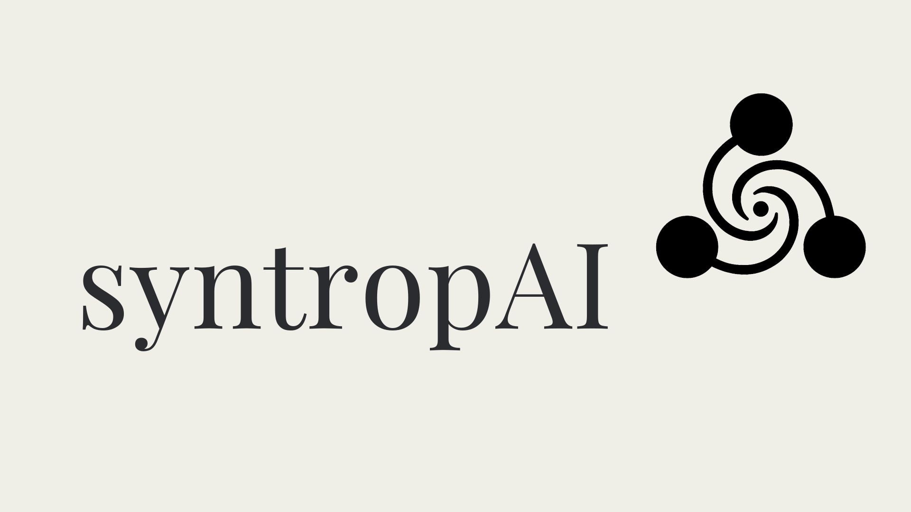

# AML Controller Authentication Implementation Guide

## Overview
This guide documents the complete implementation of multi-provider OAuth2 authentication system with a creative logo-based system status indicator for the AML Controller application.

## 🏗️ Architecture Overview

### Components Implemented
1. **OAuth2 Authentication System** - Multi-provider support (Google, Microsoft, GitHub, Oracle OCI)
2. **Session Management** - Server-side sessions with Redis/filesystem storage
3. **User Management** - SQLite database with role-based access control
4. **Security Middleware** - Route protection and audit logging
5. **Creative Status Indicator** - Logo border color changes based on system health
6. **Uniform UI Components** - Consistent header with user info across all dashboards

---

## 📋 Step-by-Step Implementation

### 1. Dependencies and Setup

#### Add Required Dependencies
```bash
# Add to requirements.txt
authlib==1.3.1
flask-session==0.5.0
flask-talisman==1.1.0
flask-limiter==3.5.0
pyjwt==2.8.0
redis==5.0.1
```

#### Environment Configuration
```bash
# .env file additions
SECRET_KEY=your-super-secret-key-for-local-testing-change-this
JWT_SECRET_KEY=your-jwt-secret-key-for-local-testing-change-this

# Session Configuration
SESSION_TYPE=redis  # or filesystem for development
REDIS_URL=redis://localhost:6379

# OAuth2 Provider Configurations
GOOGLE_CLIENT_ID=your-google-client-id
GOOGLE_CLIENT_SECRET=your-google-client-secret
GOOGLE_REDIRECT_URI=http://localhost:5000/auth/callback/google

AZURE_CLIENT_ID=your-azure-client-id
AZURE_CLIENT_SECRET=your-azure-client-secret
AZURE_TENANT_ID=your-azure-tenant-id

GITHUB_CLIENT_ID=your-github-client-id
GITHUB_CLIENT_SECRET=your-github-client-secret

OCI_CLIENT_ID=your-oci-client-id
OCI_CLIENT_SECRET=your-oci-client-secret
OCI_INSTANCE_ID=your-oci-instance-id
```

### 2. Authentication Module Structure

Create the authentication module with proper separation of concerns:

```
src/auth/
├── __init__.py          # Module exports
├── models.py            # User and UserSession dataclasses
├── auth_manager.py      # OAuth2 provider management
├── middleware.py        # Authentication middleware
└── decorators.py        # Route protection decorators
```

#### Key Files Created:

**src/auth/models.py** - User data models
```python
@dataclass
class User:
    id: Optional[int]
    provider: str
    provider_user_id: str
    email: str
    name: str
    avatar_url: Optional[str] = None
    role: str = 'user'
    last_login: Optional[datetime] = None
    created_at: Optional[datetime] = None
    is_active: bool = True

    def to_dict(self) -> Dict:
        # Serialization for session storage
    
    def has_role(self, required_roles: list) -> bool:
        # Role-based permission checking
```

**src/auth/auth_manager.py** - OAuth2 provider management
- Registers multiple OAuth2 providers using Authlib
- Handles user creation/updates from OAuth responses
- Manages user sessions and audit logging
- Normalizes user data across different providers

**src/auth/middleware.py** - Security middleware
- Integrates with existing LoggingMiddleware
- Session validation and user context setup
- Route protection with 401/403 error handling
- Authentication event logging

**src/auth/decorators.py** - Route protection
```python
@require_auth
def protected_endpoint():
    # Requires valid authentication
    
@require_roles(['admin', 'manager'])
def admin_endpoint():
    # Requires specific roles
```

### 3. Database Schema

SQLite tables created automatically:

```sql
-- Users table
CREATE TABLE users (
    id INTEGER PRIMARY KEY AUTOINCREMENT,
    provider VARCHAR(50) NOT NULL,
    provider_user_id VARCHAR(255) NOT NULL,
    email VARCHAR(255) UNIQUE NOT NULL,
    name VARCHAR(255),
    avatar_url VARCHAR(500),
    role VARCHAR(50) DEFAULT 'user',
    last_login TIMESTAMP DEFAULT CURRENT_TIMESTAMP,
    created_at TIMESTAMP DEFAULT CURRENT_TIMESTAMP,
    is_active BOOLEAN DEFAULT TRUE,
    UNIQUE(provider, provider_user_id)
);

-- User sessions table
CREATE TABLE user_sessions (
    id INTEGER PRIMARY KEY AUTOINCREMENT,
    user_id INTEGER NOT NULL,
    session_id VARCHAR(255) UNIQUE NOT NULL,
    access_token TEXT,
    refresh_token TEXT,
    expires_at TIMESTAMP,
    created_at TIMESTAMP DEFAULT CURRENT_TIMESTAMP,
    last_activity TIMESTAMP DEFAULT CURRENT_TIMESTAMP,
    FOREIGN KEY (user_id) REFERENCES users (id) ON DELETE CASCADE
);

-- Authentication audit log
CREATE TABLE auth_audit_log (
    id INTEGER PRIMARY KEY AUTOINCREMENT,
    user_id INTEGER,
    event_type VARCHAR(50) NOT NULL,
    provider VARCHAR(50),
    ip_address VARCHAR(45),
    user_agent TEXT,
    success BOOLEAN NOT NULL,
    error_message TEXT,
    created_at TIMESTAMP DEFAULT CURRENT_TIMESTAMP,
    FOREIGN KEY (user_id) REFERENCES users (id) ON DELETE SET NULL
);
```

### 4. Flask App Integration

#### Main App Updates (src/api/app.py)
```python
# Initialize authentication components
auth_manager = AuthManager(app)
auth_middleware = AuthMiddleware(app, auth_manager)

# Configure Flask-Session
app.config['SECRET_KEY'] = os.getenv('SECRET_KEY')
app.config['SESSION_TYPE'] = os.getenv('SESSION_TYPE', 'filesystem')
app.config['SESSION_PERMANENT'] = False
app.config['SESSION_USE_SIGNER'] = True

# Add authentication routes
@app.route('/auth/login')
def auth_login():
    # Display OAuth provider selection
    
@app.route('/auth/login/<provider>')
def auth_login_provider(provider):
    # Initiate OAuth2 flow
    
@app.route('/auth/callback/<provider>')
def auth_callback(provider):
    # Handle OAuth2 callback and create session
    
@app.route('/auth/logout', methods=['GET', 'POST'])
def auth_logout():
    # Clear session and redirect
    
@app.route('/api/auth/user', methods=['GET'])
@require_auth
def get_current_user():
    # Return current user information for UI
```

#### Route Protection
```python
# Protect sensitive endpoints
@app.route('/api/dashboard/data', methods=['GET'])
@require_auth
def get_dashboard_data():
    # Protected endpoint
    
@app.route('/dashboard/minimalist.html')
@require_auth  
def minimalist_dashboard():
    # Protected dashboard access
```

### 5. Creative Logo Status Indicator Implementation

This innovative approach uses the company logo border as a system health indicator, eliminating the need for separate status components.

#### CSS Implementation
```css
/* Logo with dynamic border colors */
.page-header img {
    height: 80px;
    width: auto;
    border: 3px solid #22c55e;  /* Default green */
    border-radius: 8px;
    transition: border-color 0.3s ease;
}

/* Health status classes */
.page-header img.status-healthy {
    border-color: #22c55e; /* Green - System healthy */
}

.page-header img.status-warning {
    border-color: #f59e0b; /* Amber - Performance issues */
}

.page-header img.status-error {
    border-color: #ef4444; /* Red - System problems */
}
```

#### JavaScript Health Monitoring
```javascript
// System health monitoring variables
let systemHealthStatus = 'healthy';
let responseTimeThreshold = 2000; // 2 seconds
let errorThreshold = 3; // Consecutive errors before red status
let consecutiveErrors = 0;

// Update logo border based on system health
function updateSystemHealth(status) {
    const logo = document.getElementById('systemLogo');
    if (!logo) return;
    
    // Remove all status classes
    logo.classList.remove('status-healthy', 'status-warning', 'status-error');
    
    // Add current status class
    switch (status) {
        case 'healthy':
            logo.classList.add('status-healthy');
            break;
        case 'warning':
            logo.classList.add('status-warning');
            break;
        case 'error':
            logo.classList.add('status-error');
            break;
    }
    
    systemHealthStatus = status;
}

// Intelligent health checking
async function checkSystemHealth() {
    try {
        const startTime = Date.now();
        
        // Check multiple endpoints
        const [healthCheck, statsCheck] = await Promise.allSettled([
            fetch(`${API_BASE}/health`, {credentials: 'include'}),
            fetch(`${API_BASE}/statistics`, {credentials: 'include'})
        ]);
        
        const responseTime = Date.now() - startTime;
        
        // Determine health status based on failures and response time
        const hasFailures = healthCheck.status === 'rejected' || 
                          statsCheck.status === 'rejected' ||
                          (healthCheck.value && !healthCheck.value.ok) ||
                          (statsCheck.value && !statsCheck.value.ok);
        
        if (hasFailures) {
            consecutiveErrors++;
            if (consecutiveErrors >= errorThreshold) {
                updateSystemHealth('error');
            }
        } else {
            consecutiveErrors = 0;
            // Check response time for performance warning
            if (responseTime > responseTimeThreshold) {
                updateSystemHealth('warning');
            } else {
                updateSystemHealth('healthy');
            }
        }
        
    } catch (error) {
        consecutiveErrors++;
        if (consecutiveErrors >= errorThreshold) {
            updateSystemHealth('error');
        }
    }
}

// Initialize health monitoring
document.addEventListener('DOMContentLoaded', function() {
    checkSystemHealth();
    // Different intervals per dashboard type
    setInterval(checkSystemHealth, 10000); // 10s for main dashboard
});
```

### 6. Uniform Header Implementation

#### HTML Structure
```html
<!-- Combined Page Title and Header -->
<div class="page-header">
    <div class="page-header-left">
        <a href="/" style="display: inline-block;">
            
        </a>
        <div class="page-title-content">
            <h1>AML Dashboard</h1>
            <p>Real-time Anti-Money Laundering Detection & Monitoring</p>
        </div>
    </div>
    <div class="page-header-right">
        <div class="user-info" id="userInfo" style="display: none;">
            
            <div class="user-details">
                <span id="userName" class="user-name">Loading...</span>
                <span id="userEmail" class="user-email"></span>
            </div>
        </div>
        <button id="logoutBtn" class="logout-btn" onclick="logout()">Logout</button>
    </div>
</div>
```

#### User Info Loading
```javascript
// Load and display current user information
async function loadUserInfo() {
    try {
        const response = await fetch(`${API_BASE}/auth/user`, {
            credentials: 'include'
        });
        
        if (response.ok) {
            const data = await response.json();
            const user = data.user;
            
            // Update user display
            document.getElementById('userName').textContent = user.name || 'User';
            document.getElementById('userEmail').textContent = user.email || '';
            
            // Show avatar if available
            if (user.avatar_url) {
                const avatar = document.getElementById('userAvatar');
                avatar.src = user.avatar_url;
                avatar.style.display = 'block';
            }
            
            // Show user info section
            document.getElementById('userInfo').style.display = 'flex';
        }
    } catch (error) {
        console.error('Error loading user info:', error);
    }
}
```

---

## 🎨 Creative Status Indicator Benefits

### Traditional vs. Creative Approach

**Before (Traditional):**
- Separate status dot indicator
- Text labels ("System Online")
- Uptime display taking screen space
- Multiple UI elements for system status

**After (Creative Logo Approach):**
- Logo border color indicates system health
- No additional UI elements needed
- Clean, minimal design
- Always visible (logo present on every page)
- Professional appearance

### Health Status Logic

| Status | Border Color | Condition | Behavior |
|--------|-------------|-----------|----------|
| **Healthy** | 🟢 Green `#22c55e` | All APIs responding in <2s | Default state, reset after successful checks |
| **Warning** | 🟡 Amber `#f59e0b` | APIs responding but slow >2s | Performance degradation indicator |
| **Error** | 🔴 Red `#ef4444` | 3+ consecutive API failures | Critical system issues |

### Monitoring Configuration

| Dashboard | Check Interval | Rationale |
|-----------|---------------|-----------|
| Minimalist Dashboard | 10 seconds | Most active, needs responsive status |
| Data Generator | 15 seconds | Moderate usage, balanced monitoring |
| Search Dashboard | 20 seconds | Less frequent usage, lighter monitoring |

---

## 🔐 Security Implementation

### Authentication Flow
1. **User Access** → Protected route requires authentication
2. **Redirect** → User redirected to `/auth/login` 
3. **Provider Selection** → User chooses OAuth2 provider
4. **OAuth2 Flow** → Standard OAuth2 authorization code flow
5. **User Creation** → Create/update user record in database
6. **Session Creation** → Establish server-side session
7. **Access Granted** → User can access protected resources

### Session Security
- **Server-side sessions** - No sensitive data in browser
- **Signed cookies** - Tamper-proof session identifiers
- **Session expiration** - Configurable timeout periods
- **Secure headers** - HTTPS-only in production
- **CSRF protection** - Built-in Flask-Session protection

### Role-Based Access Control
```python
# User roles hierarchy
ROLES = {
    'user': ['read'],
    'analyst': ['read', 'analyze'],
    'manager': ['read', 'analyze', 'manage'],
    'admin': ['read', 'analyze', 'manage', 'admin']
}

# Usage in routes
@require_roles(['manager', 'admin'])
def sensitive_operation():
    # Only managers and admins can access
```

---

## 🚀 Deployment Configuration

### Local Development
```bash
# Use filesystem sessions for simplicity
SESSION_TYPE=filesystem

# OAuth2 redirect URIs
GOOGLE_REDIRECT_URI=http://localhost:5000/auth/callback/google
```

### Production (Render.com)

#### 1. Render.com Deployment Setup

**Step 1: Create Web Service**
1. Connect your GitHub repository to Render
2. Select "Web Service" 
3. Configure build settings:
   - **Build Command**: `pip install -r requirements.txt`
   - **Start Command**: `cd src && python api/app.py`
   - **Environment**: `Python 3.11+`

**Step 2: Configure Environment Variables**
In Render dashboard → Environment tab, add:

```bash
# Flask Configuration
FLASK_ENV=production
SECRET_KEY=generate-cryptographically-secure-secret-key-here
JWT_SECRET_KEY=generate-another-secure-key-here

# Session Configuration
SESSION_TYPE=redis
REDIS_URL=redis://red-xxxxxx:6379  # Use Render Redis URL

# OAuth2 Production Redirect URIs
GOOGLE_CLIENT_ID=your-production-client-id
GOOGLE_CLIENT_SECRET=your-production-client-secret
GOOGLE_REDIRECT_URI=https://your-app-name.onrender.com/auth/callback/google

MICROSOFT_CLIENT_ID=your-azure-client-id
MICROSOFT_CLIENT_SECRET=your-azure-client-secret
MICROSOFT_REDIRECT_URI=https://your-app-name.onrender.com/auth/callback/microsoft

GITHUB_CLIENT_ID=your-github-client-id
GITHUB_CLIENT_SECRET=your-github-client-secret
GITHUB_REDIRECT_URI=https://your-app-name.onrender.com/auth/callback/github

OCI_CLIENT_ID=your-oci-client-id
OCI_CLIENT_SECRET=your-oci-client-secret
OCI_DOMAIN=your-oci-identity-domain
OCI_REDIRECT_URI=https://your-app-name.onrender.com/auth/callback/oracle
```

#### 2. Redis Setup on Render
1. Create a Redis service in Render dashboard
2. Note the Redis URL (format: `redis://red-xxxxx:6379`)
3. Add Redis URL to web service environment variables
4. Ensure Redis and web service are in same region for low latency

#### 3. OAuth Provider Updates for Production

**Google Cloud Console:**
1. Go to Google Cloud Console → APIs & Services → Credentials
2. Edit your OAuth 2.0 Client ID
3. Add authorized redirect URI: `https://your-app-name.onrender.com/auth/callback/google`
4. Add authorized JavaScript origins: `https://your-app-name.onrender.com`

**Microsoft Azure Portal:**
1. Go to Azure Portal → App registrations → Your app
2. Navigate to Authentication
3. Add redirect URI: `https://your-app-name.onrender.com/auth/callback/microsoft`
4. Ensure "Access tokens" and "ID tokens" are enabled

**GitHub:**
1. Go to GitHub → Settings → Developer settings → OAuth Apps
2. Edit your OAuth App
3. Update Authorization callback URL: `https://your-app-name.onrender.com/auth/callback/github`

**Oracle Cloud Infrastructure:**
1. Access OCI Console → Identity Domain → Applications
2. Edit your application
3. Update redirect URIs: `https://your-app-name.onrender.com/auth/callback/oracle`

#### 4. Render.com Specific Considerations

**Health Checks:**
Render automatically pings your app's health endpoint. Ensure `/api/health` responds properly:
```python
@app.route('/api/health', methods=['GET'])
def health_check():
    return jsonify({
        'status': 'healthy',
        'timestamp': datetime.now().isoformat()
    })
```

**Static Files:**
Configure static file serving for dashboard assets:
```python
# In app.py
from flask import Flask, send_from_directory
import os

@app.route('/dashboard/<path:filename>')
def dashboard_static(filename):
    return send_from_directory('../dashboard', filename)

@app.route('/images/<path:filename>')  
def images_static(filename):
    return send_from_directory('../images', filename)
```

**Logging:**
Render captures stdout/stderr. Use structured logging:
```python
import logging
import sys

# Configure logging for Render
logging.basicConfig(
    level=logging.INFO,
    format='%(asctime)s - %(name)s - %(levelname)s - %(message)s',
    handlers=[logging.StreamHandler(sys.stdout)]
)
```

**SSL/HTTPS:**
Render provides automatic SSL certificates. Update Flask-Session configuration:
```python
if os.getenv('FLASK_ENV') == 'production':
    app.config['SESSION_COOKIE_SECURE'] = True
    app.config['SESSION_COOKIE_HTTPONLY'] = True
    app.config['SESSION_COOKIE_SAMESITE'] = 'Lax'
```

#### 5. Deployment Checklist

Before deploying to Render:
- ✅ All OAuth providers updated with production redirect URIs
- ✅ Environment variables configured in Render dashboard  
- ✅ Redis service created and URL configured
- ✅ Secret keys generated (use `python -c "import secrets; print(secrets.token_hex(32))"`)
- ✅ Health endpoint accessible
- ✅ Static file routes configured
- ✅ Logging configured for production
- ✅ SSL session cookies enabled

#### 6. Post-Deployment Verification

After deployment:
1. **Test OAuth Flow**: Verify each provider's authentication works
2. **Check Session Management**: Login, navigate, logout functionality  
3. **Verify Status Indicator**: Logo border changes based on system health
4. **Monitor Logs**: Check Render logs for any errors or warnings
5. **Test Protected Routes**: Ensure authentication is required for dashboards
6. **Performance Check**: Verify response times and health check intervals

---

## 📚 Best Practices for Additional Providers

### Microsoft Azure AD

#### 1. Azure App Registration Setup
1. Go to [Azure Portal](https://portal.azure.com/) → Azure Active Directory → App registrations
2. Click "New registration"
3. Configure:
   - **Name**: "AML Controller"
   - **Supported account types**: "Accounts in any organizational directory and personal Microsoft accounts"
   - **Redirect URI**: `http://localhost:5000/auth/callback/microsoft` (development)
4. Note the **Application (client) ID**
5. Create a client secret in "Certificates & secrets"
6. Add redirect URIs for production environment

#### 2. Code Implementation
```python
# In auth_manager.py _register_providers() method
if microsoft_client_id and not microsoft_client_id.startswith('your-'):
    self.oauth.register(
        name='microsoft',
        client_id=microsoft_client_id,
        client_secret=microsoft_client_secret,
        authorize_url='https://login.microsoftonline.com/common/oauth2/v2.0/authorize',
        access_token_url='https://login.microsoftonline.com/common/oauth2/v2.0/token',
        api_base_url='https://graph.microsoft.com/',
        client_kwargs={'scope': 'User.Read email profile'}
    )

# Add user info normalization
elif provider == 'microsoft':
    return {
        'provider_user_id': str(user_info.get('id')),
        'email': user_info.get('mail') or user_info.get('userPrincipalName'),
        'name': user_info.get('displayName'),
        'avatar_url': None  # Requires separate Graph API call
    }
```

#### 3. Environment Variables
```bash
MICROSOFT_CLIENT_ID=your-application-id-here
MICROSOFT_CLIENT_SECRET=your-client-secret-here
MICROSOFT_REDIRECT_URI=http://localhost:5000/auth/callback/microsoft
```

### GitHub

#### 1. GitHub OAuth App Setup
1. Go to GitHub Settings → Developer settings → OAuth Apps
2. Click "New OAuth App"
3. Configure:
   - **Application name**: "AML Controller"
   - **Homepage URL**: `http://localhost:5000`
   - **Authorization callback URL**: `http://localhost:5000/auth/callback/github`
4. Note the **Client ID** and generate **Client Secret**

#### 2. Code Implementation  
```python
# In auth_manager.py _register_providers() method
if github_client_id and not github_client_id.startswith('your-'):
    self.oauth.register(
        name='github',
        client_id=github_client_id,
        client_secret=github_client_secret,
        authorize_url='https://github.com/login/oauth/authorize',
        access_token_url='https://github.com/login/oauth/access_token',
        api_base_url='https://api.github.com/',
        client_kwargs={'scope': 'user:email'}
    )

# Add user info normalization
elif provider == 'github':
    return {
        'provider_user_id': str(user_info.get('id')),
        'email': user_info.get('email'),
        'name': user_info.get('name') or user_info.get('login'),
        'avatar_url': user_info.get('avatar_url')
    }
```

#### 3. Environment Variables
```bash
GITHUB_CLIENT_ID=your-client-id-here
GITHUB_CLIENT_SECRET=your-client-secret-here
GITHUB_REDIRECT_URI=http://localhost:5000/auth/callback/github
```

### Oracle Cloud Infrastructure (OCI)

#### 1. OCI Identity Domain Setup
1. Access OCI Console → Identity & Security → Domains
2. Select your identity domain
3. Go to Integrated applications → Add application
4. Choose "Confidential Application"
5. Configure OAuth settings and note client credentials
6. Set redirect URIs for your application

#### 2. Code Implementation
```python
# In auth_manager.py _register_providers() method
if oci_client_id and not oci_client_id.startswith('your-'):
    oci_domain = os.getenv('OCI_DOMAIN')
    self.oauth.register(
        name='oracle',
        client_id=oci_client_id,
        client_secret=oci_client_secret,
        authorize_url=f'https://{oci_domain}.identity.oraclecloud.com/oauth2/v1/authorize',
        access_token_url=f'https://{oci_domain}.identity.oraclecloud.com/oauth2/v1/token',
        api_base_url=f'https://{oci_domain}.identity.oraclecloud.com/',
        client_kwargs={'scope': 'openid profile email'}
    )

# Add user info normalization  
elif provider == 'oracle':
    return {
        'provider_user_id': user_info.get('sub'),
        'email': user_info.get('email'), 
        'name': user_info.get('name'),
        'avatar_url': None
    }
```

#### 3. Environment Variables
```bash
OCI_CLIENT_ID=your-client-id-here
OCI_CLIENT_SECRET=your-client-secret-here
OCI_DOMAIN=your-identity-domain-here
OCI_REDIRECT_URI=http://localhost:5000/auth/callback/oracle
```

### Universal Provider Addition Steps

For any new OAuth2 provider, follow this systematic approach:

1. **Register OAuth Application** with the provider
2. **Add provider configuration** to `_register_providers()` method in auth_manager.py
3. **Create profile normalization** method in `_normalize_user_info()` 
4. **Add route handlers** (automatically handled by existing generic routes)
5. **Update environment variables** in `.env` and production
6. **Add provider button** to login page HTML
7. **Test authentication flow** thoroughly
8. **Update this documentation** with provider-specific setup instructions

### Provider Testing Checklist

For each new provider, verify:
- ✅ OAuth2 authorization redirect works
- ✅ Callback handles token exchange properly  
- ✅ User profile information is retrieved correctly
- ✅ User account is created/updated in database
- ✅ Session is established successfully
- ✅ User can access protected routes
- ✅ Logout clears session properly

---

## 🔧 Troubleshooting Common Issues

### OAuth2 Provider Errors
```bash
# Common fixes for OAuth2 issues
1. Verify redirect URIs match exactly (including http/https)
2. Check client ID/secret are not placeholder values
3. Ensure proper scopes are requested
4. Validate provider-specific requirements (tenant ID, etc.)
```

### Session Issues
```bash
# Session troubleshooting
1. Check SECRET_KEY is set and consistent
2. Verify Redis connection if using Redis sessions
3. Clear browser cookies/localStorage
4. Check session expiration settings
```

### Logo Status Indicator
```bash
# Status indicator troubleshooting
1. Verify logo has ID 'systemLogo' 
2. Check API endpoints are accessible
3. Monitor browser console for JavaScript errors
4. Validate CSS classes are being applied
```

---

## 📊 Performance Considerations

### Health Check Optimization
- **Endpoint Selection** - Monitor critical API endpoints only
- **Check Intervals** - Balance responsiveness with server load
- **Error Thresholds** - Avoid false positives with consecutive error logic
- **Response Timeouts** - Set reasonable thresholds (2s default)

### Session Management
- **Redis for Scale** - Use Redis for multiple server instances
- **Session Cleanup** - Implement session cleanup for expired sessions
- **Memory Usage** - Monitor session storage size

---

## 🎯 Future Enhancements

### Potential Improvements
1. **Multi-Factor Authentication** - Add TOTP/SMS verification
2. **Social Login Expansion** - Add LinkedIn, Twitter, etc.
3. **Advanced RBAC** - Implement resource-based permissions
4. **Session Analytics** - Track user activity and patterns
5. **Health Dashboard** - Detailed system health metrics page

### Monitoring Enhancements
1. **Alert Integration** - Connect status to alerting systems
2. **Performance Metrics** - Track response times over time
3. **User Activity** - Monitor authentication patterns
4. **Security Events** - Enhanced audit trail analysis

---

## 📝 Version History

### v3.1.0 (Current)
- ✅ Multi-provider OAuth2 authentication
- ✅ Creative logo-based status indicator  
- ✅ Uniform header with user info display
- ✅ Enterprise session management
- ✅ Comprehensive security middleware

### Future Versions
- v3.2.0: Multi-factor authentication
- v3.3.0: Advanced role management
- v3.4.0: SSO enterprise integration

---

## 👥 Team Resources

### For Developers
- Follow this guide for adding new OAuth2 providers
- Maintain consistent UI patterns across dashboards
- Use the status indicator pattern for other system components

### For DevOps
- Set up OAuth2 provider applications
- Configure production environment variables
- Monitor authentication metrics and performance

### For Security
- Regular OAuth2 provider credential rotation
- Monitor authentication audit logs
- Review session security configurations

---

*This implementation guide serves as the definitive reference for the AML Controller authentication system and creative status indicator. Keep this documentation updated as the system evolves.*