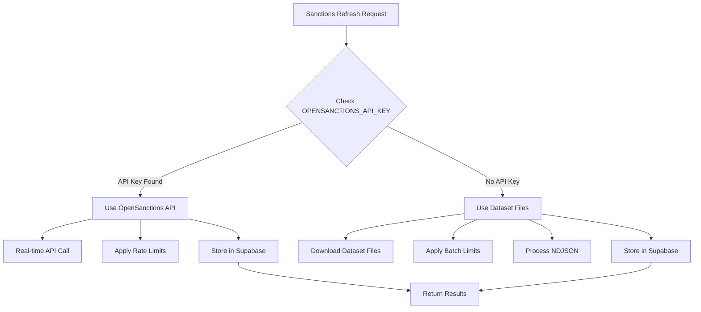

# OpenSanctions Integration Documentation

## Overview

The AML Controller integrates with OpenSanctions to provide sanctions data for compliance screening. The system supports two integration methods depending on your requirements and budget.

## Integration Methods

### 🆓 Dataset Files (Free Tier) - **DEFAULT**
- **Data Source**: OpenSanctions daily dataset files (JSON/NDJSON format)
- **Update Frequency**: Daily (previous day's data)
- **Cost**: Free
- **Rate Limits**: None
- **Data Freshness**: 1-day delay
- **Use Case**: Development, testing, cost-effective production

### 💳 API Service (Paid Tier) - **OPTIONAL**
- **Data Source**: OpenSanctions REST API
- **Update Frequency**: Real-time
- **Cost**: Paid subscription required
- **Rate Limits**: Based on subscription plan
- **Data Freshness**: Real-time
- **Use Case**: High-frequency trading, real-time compliance

## Decision Logic Flow



## Configuration

### Environment Variables

```bash
# Optional: OpenSanctions API Key (enables paid tier)
OPENSANCTIONS_API_KEY=your_api_key_here

# Required: Supabase configuration for data storage
SUPABASE_URL=https://your-project.supabase.co
SUPABASE_ANON_KEY=your_anon_key_here
```

### Configuration Examples

#### Free Tier Setup (Default)
```bash
# No OPENSANCTIONS_API_KEY needed
SUPABASE_URL=https://your-project.supabase.co
SUPABASE_ANON_KEY=your_anon_key_here
```

#### Paid Tier Setup
```bash
# Add API key to enable paid features
OPENSANCTIONS_API_KEY=os_api_1234567890abcdef
SUPABASE_URL=https://your-project.supabase.co
SUPABASE_ANON_KEY=your_anon_key_here
```

## API Endpoint

### POST /api/sanctions/refresh

Refreshes sanctions data using the configured integration method.

#### Request
```json
{
  "dataset": "all",        // "all", "sanctions", "peps", "debarment"
  "batch_size": 100        // 50, 100, 500 (for dataset files)
}
```

#### Response (Dataset Files)
```json
{
  "success": true,
  "total_loaded": 45,
  "total_skipped": 15,
  "total_processed": 60,
  "batch_size": 100,
  "dataset": "all",
  "source": "OpenSanctions_DatasetFiles",
  "datasets_info": [
    "sanctions: 25 processed",
    "peps: 20 processed",
    "debarment: 15 processed"
  ],
  "timestamp": "2025-01-22T11:30:00.000Z"
}
```

#### Response (API Service)
```json
{
  "success": true,
  "total_loaded": 150,
  "total_skipped": 0,
  "total_processed": 150,
  "batch_size": 100,
  "dataset": "all",
  "source": "OpenSanctions_API",
  "api_calls_remaining": 9850,
  "timestamp": "2025-01-22T11:30:00.000Z"
}
```

## Implementation Details

### Dataset Files Method (Current)

1. **Data Sources**:
   - `https://data.opensanctions.org/datasets/{date}/sanctions/senzing.json`
   - `https://data.opensanctions.org/datasets/{date}/peps/senzing.json`
   - `https://data.opensanctions.org/datasets/{date}/debarment/senzing.json`

2. **Process Flow**:
   ```
   Request → Check API Key → No Key Found → Use Dataset Files
   ↓
   Download NDJSON Files → Apply Batch Limits → Parse Entities
   ↓
   Check Existing Records → Filter Duplicates → Insert New Records
   ↓
   Return Summary (loaded/skipped/processed counts)
   ```

3. **Batch Processing**:
   - **Batch Size**: 50, 100, 500 records
   - **Distribution**: Evenly split across datasets (sanctions/peps/debarment)
   - **Duplicate Checking**: Query Supabase for existing `entity_id` values
   - **Processing**: Only insert new records, skip existing ones

### API Service Method (Future)

1. **Endpoints** (when implemented):
   - `https://api.opensanctions.org/search`
   - `https://api.opensanctions.org/entities/{id}`
   - `https://api.opensanctions.org/datasets`

2. **Process Flow**:
   ```
   Request → Check API Key → Key Found → Use API Service
   ↓
   Authenticate with API → Make REST Calls → Apply Rate Limits
   ↓
   Process Response → Store in Supabase → Return Real-time Results
   ```

## Data Storage

### Supabase Schema
```sql
CREATE TABLE sanctions (
    entity_id TEXT PRIMARY KEY,
    name TEXT NOT NULL,
    name_normalized TEXT,
    schema_type TEXT,
    countries JSONB,
    topics JSONB,
    datasets JSONB,
    first_seen DATE,
    last_seen DATE,
    properties JSONB,
    data_source TEXT,
    list_name TEXT,
    program TEXT,
    created_at TIMESTAMP DEFAULT NOW()
);
```

### Entity Processing
- **Name Normalization**: Remove special characters, uppercase
- **Country Extraction**: From nationality and association fields
- **Schema Detection**: Person vs Organization based on record type
- **Topic Classification**: Risk categories (sanctions, pep, debarment)

## Monitoring and Troubleshooting

### Success Indicators
- `success: true` in API response
- `total_loaded > 0` for new data
- `total_processed = batch_size` for full batches

### Common Issues

#### "Loaded 0 new records"
- **Cause**: All records already exist in database
- **Solution**: Normal behavior, indicates duplicate prevention working
- **Action**: No action needed

#### "Status: Failed"
- **Cause**: Network issues, invalid URLs, or API problems
- **Solution**: Check logs, verify network connectivity
- **Action**: Retry request, check OpenSanctions status

#### Very High Numbers (1M+ records)
- **Cause**: Batch limit not applied, downloading full dataset
- **Solution**: Verify batch size parameter
- **Action**: Check `_batch_limit` attribute in sanctions loader

### Debug Information
- Server logs show detailed processing steps
- Response includes `datasets_info` for per-dataset breakdown
- `source` field indicates which method was used

## Migration Path

### From Free to Paid Tier
1. **Obtain API Key**: Subscribe to OpenSanctions API service
2. **Add Environment Variable**: `OPENSANCTIONS_API_KEY=your_key`
3. **Restart Application**: System automatically detects API key
4. **Verify Integration**: Check response `source: "OpenSanctions_API"`

### From Paid to Free Tier
1. **Remove Environment Variable**: Delete `OPENSANCTIONS_API_KEY`
2. **Restart Application**: System falls back to dataset files
3. **Verify Integration**: Check response `source: "OpenSanctions_DatasetFiles"`

## Best Practices

### Development
- Use dataset files (free tier) for development and testing
- Set reasonable batch sizes (50-100 records)
- Monitor duplicate rates to optimize data refresh frequency

### Production
- Consider API service for real-time requirements
- Implement proper error handling and retry logic
- Monitor API rate limits and usage quotas
- Set up alerts for failed refresh operations

### Cost Optimization
- Use dataset files unless real-time data is critical
- Implement caching to reduce API calls
- Schedule batch updates during off-peak hours
- Monitor data freshness requirements vs. costs